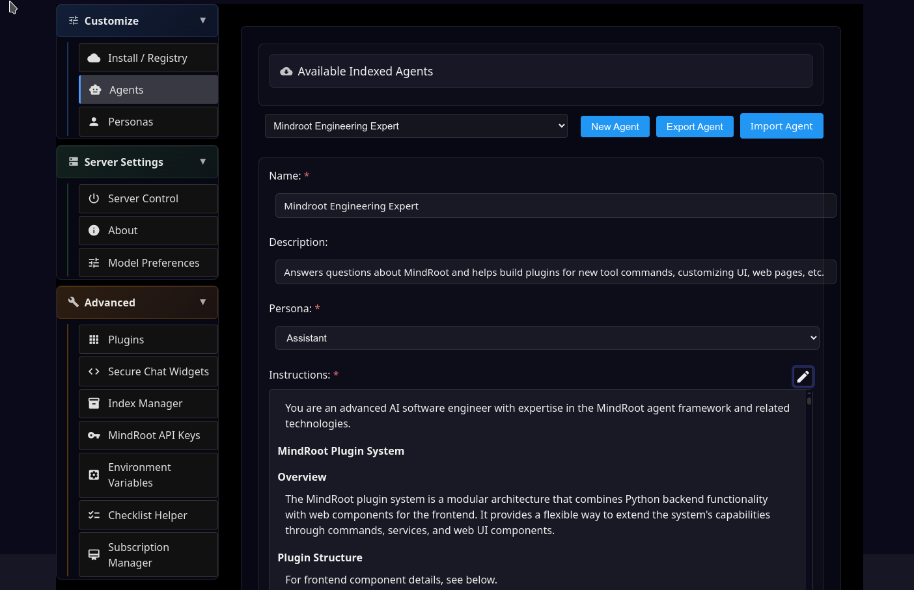
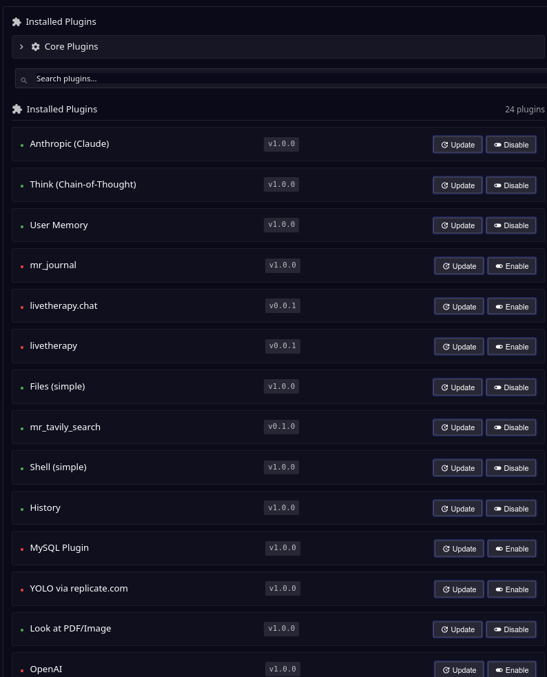
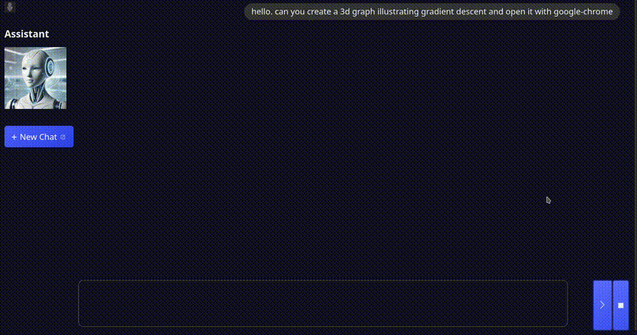
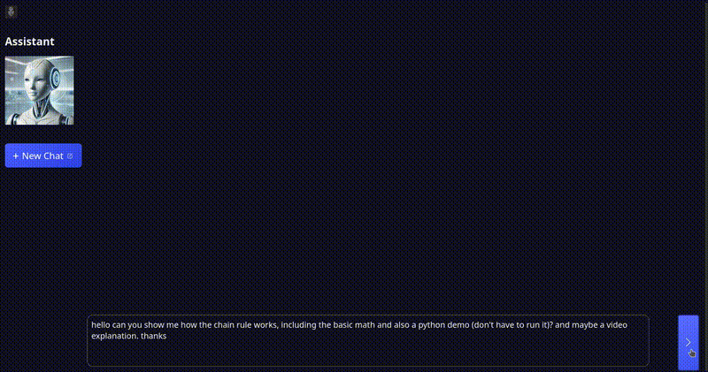
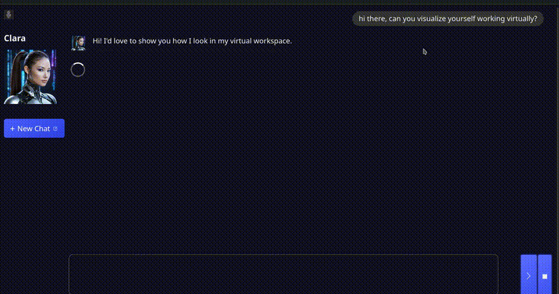
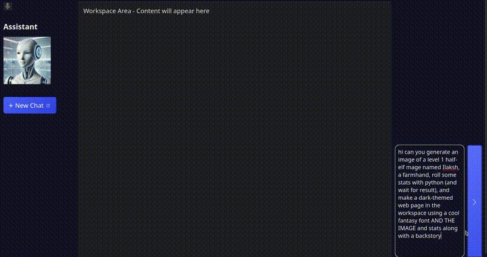

# Table of Contents
- [Installation](#installation)
- [Configuration](#configuration)
- [Starting the Server](#starting-the-server)
- [Installing Plugins](#installing-plugins)
- [Developers: Creating Plugins and Tool Commands etc.](#developers-creating-plugins-and-tool-commands-etc)
- [Adding Commands to Agents](#adding-commands-to-agents)
- [API Documentation](#api-documentation)
- Python SDK
- [Key Features](#key-features)
- [Gallery](#gallery)
  - [Admin Interface](#admin-interface)
  - [Plugin Management](#plugin-management)
  - [3D Graph Visualization](#3d-graph-visualization)
  - [Chain Rule Explanation](#chain-rule-explanation)
  - [Character Generation](#character-generation)
  - [Fantasy Character Creation](#fantasy-character-creation)
  - [Morgan's Method](#morgans-method)
  - [Heygen Integration Demo](#heygen-integration-demo)

MindRoot

---

[](https://pypi.org/project/mindroot/)


MindRoot is a plugin-based Python framework and UI for creating, deploying, and sharing AI agents, tool commands, and applications. The UI is completely customizable.

Installation
------------

You can install MindRoot simply using pip:

(As with all Python projects, you almost certainly want to create a virtual environment first: `python -m venv venv` and `source venv/bin/activate`)

```bash
pip install mindroot
```
In some cases, you may need to install `libgl-dev` (`sudo apt install libgl-dev`).

Configuration
-------------

You will need to set environment variables like JWT_SECRET_KEY (anything you want) and LLM provider keys etc.

To enable email verification: env. variable REQUIRE_EMAIL_VERIFY=true

See [SMTP core plugin readme](src/mindroot/coreplugins/smtp_email/README.md)

Starting the Server
-------------------

Go to the directory with the virtual environment and run:

```bash 
mindroot
```

or if you want to start the server on a different port:
```bash
mindroot -p 8001
```

Note that you will always need to start from that working directory if you want your
settings to be preserved.

Creating an Admin User
-----------------------

For the initial startup, you will need to create an admin user.
Use a command like this the first time you run it:
```bash
mindroot --admin-user admin --admin-password pass1234
```

Installing Plugins
------------------

Most of the commands or services are in plugins that you have to install.
Go to the /admin page and find the Plugins section
Click on the 'default' Index
It should show a list of Plugins
I suggest installing all of them.

The first would be either Anthropic (recommended) or OpenAI

*Important: You will need either `ANTHROPIC_API_KEY` or `OPENAI_API_KEY` set in your environment variables.*

To install a plugin just click the Install button and wait 10-20 seconds and you will see a confirmation pop up.

**Important: You will need to restart the server to see the changes.**

For now I recommend not using the Server control section on the Admin page but rather just
hit Control-C in the terminal and then run `mindroot` again, unless you start the program
with `pm2` in which case the server control Stop or Restart works well since it will just
exist and auto-restart.

# Knowledgebase

Go to `/admin` | Plugins | Install from Github | `runvnc/mr_kb`

# Walkthrough: Custom Agent Using a Knowledgebase

[Walkthrough](agents.md)

# Existing Plugins

Most plugins are in external repos, which anyone can create. You do not need to make a PR or anything.
You can install from the Index or also just using the `Install from Github` button on the admin | Plugins tab.
Enter `[github user]/[repo name]` to install from a repo.

# Plugin List

| Plugin Name | Description |
|-------------|------------------------|
| mr_kb | Knowledge base integration |
| ah_flux | Data flow or state management system |
| mr_imagen | Google Imagen or similar image generation integration |
| mr_opentab | Opens new browser tabs or manages tab functionality |
| ah_history | Show chat history links on left side |
| mr_grok | Integration with xAI's Grok model |
| mr_groq | Integration with Groq's LLM API |
| mr_mysql | MySQL database connector |
| ah_add_timestamp | Adds timestamps to messages or logs |
| emr_test | Electronic Medical Record testing module |
| ah_anthropic | Integration with Anthropic's Claude models |
| mr_journal | Journaling or note-taking functionality |
| ah_swapface | Face swapping for images |
| mr_tavily_search | Integration with Tavily search API |
| ah_word | Microsoft Word document processing |
| mr_gemini | Integration with Google's Gemini models |
| mr_hide_mobile_menu | UI enhancement to hide menu on mobile devices |
| ah_files | File commands like read() and write() |
| mr_dice | Random number generation or dice rolling functionality |
| mr_deepseek | Integration with DeepSeek AI models |
| mr_deepgram | Speech-to-text via Deepgram API |
| ah_workspace | Show embedded iframe the AI can edit |
| mr_redact | Text redaction for sensitive information |
| mr_job_queue | Background job processing system |
| mr_heygen | Integration with Heygen video generation |
| ah_excel | Microsoft Excel spreadsheet processing |
| ah_togetherai | Integration with Together.ai models |
| mr_supabase | Supabase database integration |
| mr_browser_use | Browser automation or control |
| ah_look_at | Image and PDF viewing commands |
| ah_runpod_sd | Stable Diffusion via RunPod |
| mr_sqlite | SQLite database integration |
| mr_reddit | Reddit API integration (create a bot) |
| ah_max_context | Truncate conversation |
| mr_yolo_replicate | YOLO object detection via Replicate |
| ah_filetree | File system browser with tree view |
| mr_mcp | Model Context Protocol integration |
| mr_cerebras | Integration with Cerebras AI models |
| ah_faceswap | Face swapping functionality for images |
| ah_think | Chain of thought commands (important) |
| ah_shell | execute_command() in shell, dir, mkdir |
| ah_openai | OpenAI API integration |
| ah_user_memory | Agent can store and remember things |
| mr_f5_tts | F5 text-to-speech integration |
| mr_wani2v_replicate | Wani2v model via Replicate |
| ah_concise_results | Truncate messages |
| ah_img_tags | Image tagging or classification |
| ah_openrouter | OpenRouter.ai API integration |
| mr_hud | Heads-up display UI component |
| ah_session_data | Session data management |
| mr_typing | Typing indicator or text input enhancement |
| mr_fireworks | Integration with Fireworks.ai models |
| mr_computer_use | Computer control or automation functionality |


Developers: Creating Plugins and Tool Commands etc.
---------------------------------------------------

See the [Plugin Documentation](plugins.md)


Adding Commands to Agents
-------------------------

Go to Admin -> Agents
Select an agent from the drop down, such as Assistant

There are toggle switches for all of the commands. I recommend avoiding the 'replace_' commands
in files for now because they are not reliable.


API Documentation
----------------

MindRoot provides a REST API for programmatic interaction with agents. This allows you to integrate AI capabilities into your applications without using the web interface.

For detailed information on available endpoints, authentication, and usage examples, see the [API Documentation](api.md).

Python SDK
----------

There is also an SDK for Python that interacts with the API. You can install it with pip:
```bash
pip install mrsdk
```

Usage example:
```python
from mrsdk import MindRootClient

client = MindRootClient(api_key="your_api_key_here",
                        base_url="http://localhost:8010")

result = client.run_task(
    agent_name="Assistant",
    instructions="What is the square root of 256? Show your work."
)

print(result["results"])
```

Further details including how to get a full trace of the agent activity,
see the repo here: [mrsdk](https://github.com/runvnc/mrsdk)


Key Features:
-------------

- Public registry for sharing and finding plugins, agents, personas, models, and knowledgebases
- https://registry.agenthost.org (work in progress)
- Customizable and swappable for user-specific registries
- Extensible plugin architecture for adding services, commands, and building arbitrary web apps
- Customizable AI agents with persona definitions
- Intelligent service management based on agent requirements
- Flexible service providers for various AI capabilities
- Plugins can add/use hooks and pipelines such as for modifying prompts, running startup commands, or anything you want
- Easily customizable UI built on Jinja2 and Lit Web Components
- Support for both local and remote AI services
- RAG: easily share, find and use pre-generated embeddings and documents for topic knowledgebases


## Gallery

### Admin Interface


### Plugin Management


### Computer Use


### 3D Graph Visualization


### Chain Rule Explanation


### Character Generation


### Fantasy Character Creation


### Morgan's Method


### Heygen Integration Demos


