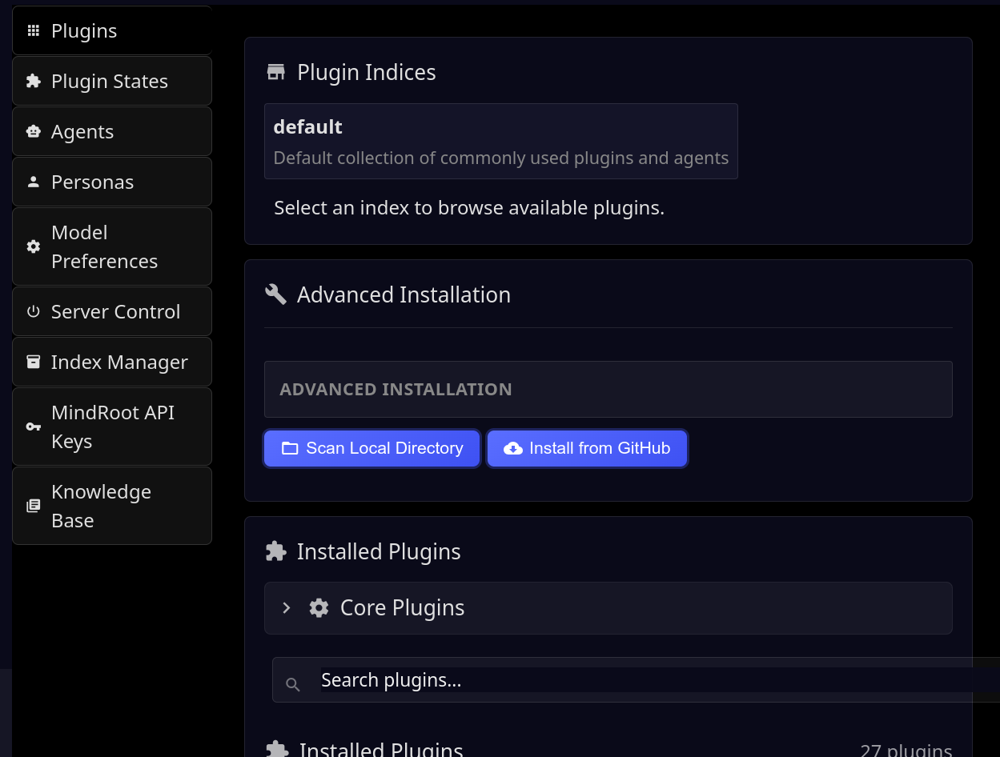
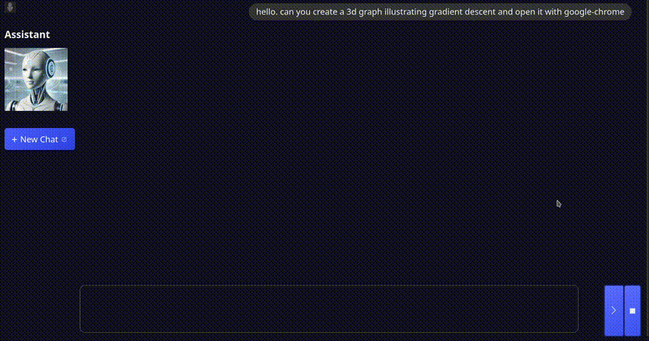
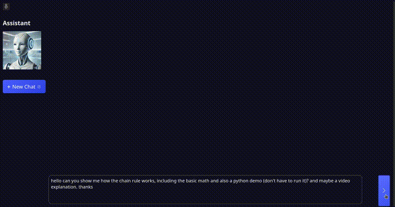
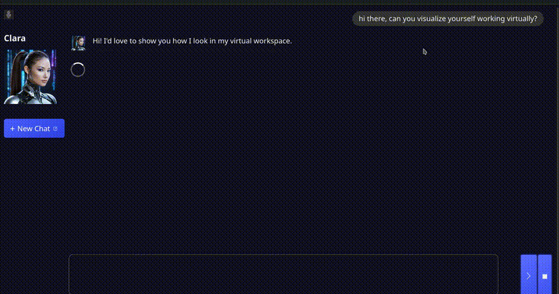
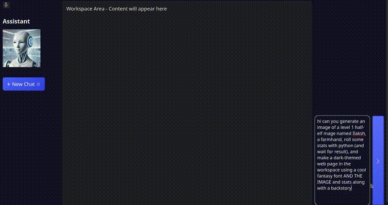
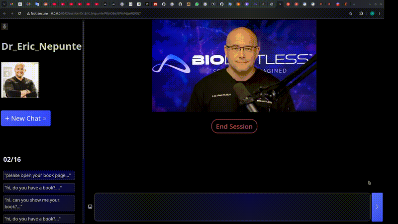

# Table of Contents
- [Gallery](#gallery)
  - [Admin Interface](#admin-interface)
  - [Plugin Management](#plugin-management)
  - [3D Graph Visualization](#3d-graph-visualization)
  - [Chain Rule Explanation](#chain-rule-explanation)
  - [Character Generation](#character-generation)
  - [Fantasy Character Creation](#fantasy-character-creation)
  - [Morgan's Method](#morgans-method)
  - [Heygen Integration Demo](#heygen-integration-demo)
- [Installation](#installation)
- [Configuration](#configuration)
- [Starting the Server](#starting-the-server)
- [Installing Plugins](#installing-plugins)
- [Developers: Creating Plugins and Tool Commands etc.](#developers-creating-plugins-and-tool-commands-etc)
- [Adding Commands to Agents](#adding-commands-to-agents)
- [API Documentation](#api-documentation)
- [Key Features](#key-features)


Mindroot

## Gallery

### Admin Interface


### Plugin Management


### 3D Graph Visualization


### Chain Rule Explanation


### Character Generation


### Fantasy Character Creation


### Morgan's Method


### Heygen Integration Demo


---

[](https://pypi.org/project/mindroot/)

**Note: some of the following is a work in progress and not yet functional. A few of them aren't really started.**

Mindroot is a powerful plugin-based Python framework for creating, deploying, and sharing AI agents and related models. It offers a flexible architecture with indices and a public registry (coming soon) for easily sharing and finding plugins, agents, personas, services, knowledgebases, and apps.

Installation
------------

You can install Mindroot using pip:

(You probably want to create a virtual environment first: `python -m venv venv` and `source venv/bin/activate`)
```bash
pip install mindroot
```

For development, you can install the package in editable mode:

```bash
git clone https://github.com/mindroot/mindroot.git
cd mindroot
pip install -e .
```

Configuration
-------------

You will need to set environment variables like JWT_SECRET_KEY (anything you want) and LLM provider keys etc.

To enable email verification: env. variable REQUIRE_EMAIL_VERIFY=true

See [SMTP core plugin readme](src/mindroot/coreplugins/smtp_email/README.md)

Starting the Server
-------------------

Go to the directory with the virtual environment and run:

```bash 
mindroot
```

or if you want to start the server on a different port:
```bash
mindroot -p 8001
```

Note that you will always need to start from that working directory if you want your
settings to be preserved.


Installing Plugins
------------------

Most of the commands or services are in plugins that you have to install.
Go to the /admin page and find the Plugins section
Click on the 'default' Index
It should show a list of Plugins
I suggest installing all of them.

The first would be either Anthropic (recommended) or OpenAI

*Important: You will need either `ANTHROPIC_API_KEY` or `OPENAI_API_KEY` set in your environment variables.*

To install a plugin just click the Install button and wait 10-20 seconds and you will see a confirmation pop up.

**Important: You will need to restart the server to see the changes.**

For now I recommend not using the Server control section on the Admin page but rather just
hit Control-C in the terminal and then run `mindroot` again.


Developers: Creating Plugins and Tool Commands etc.
---------------------------------------------------

See the [Plugin Documentation](plugins.md)


Adding Commands to Agents
-------------------------

Go to Admin -> Agents
Select an agent from the drop down, such as Assistant

There are toggle switches for all of the commands. I recommend avoiding the 'replace_' commands
in files for now because they are not reliable.


API Documentation
----------------

MindRoot provides a REST API for programmatic interaction with agents. This allows you to integrate AI capabilities into your applications without using the web interface.

For detailed information on available endpoints, authentication, and usage examples, see the [API Documentation](api.md).

Key Features:
-------------

- Public registry for sharing and finding plugins, agents, personas, models, and knowledgebases
  - https://registry.agenthost.org (work in progress)
  - Customizable and swappable for user-specific registries
- Extensible plugin architecture for adding services, commands, and building arbitrary web apps
- Customizable AI agents with persona definitions
- Intelligent service management based on agent requirements
- Flexible service providers for various AI capabilities
- Plugins can add/use hooks and pipelines such as for modifying prompts, running startup commands, or anything you want
- Easily customizable UI built on Jinja2 and Lit Web Components
- Support for both local and remote AI services
- RAG: easily share, find and use pre-generated embeddings and documents for topic knowledgebases
