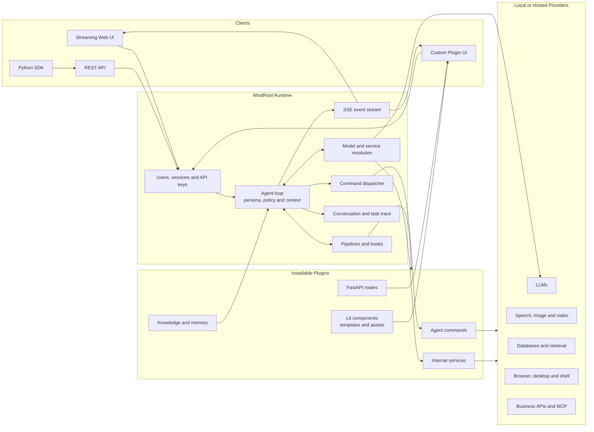
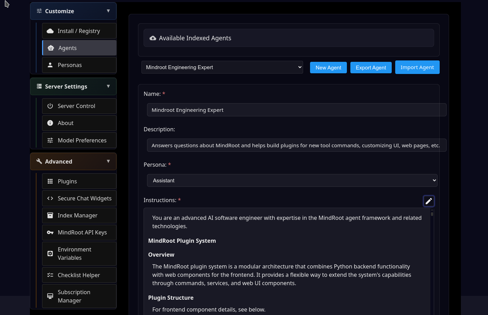
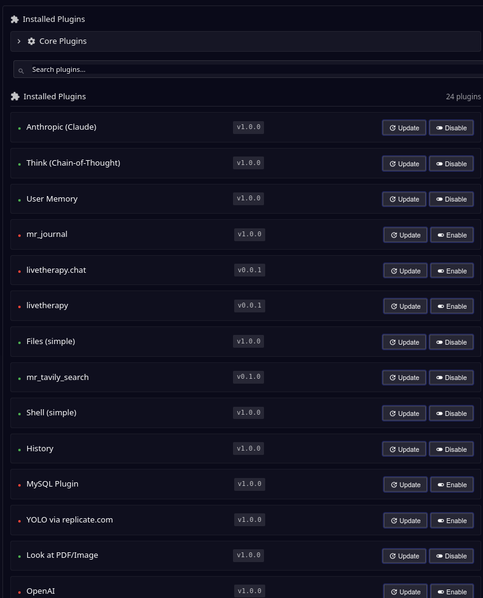
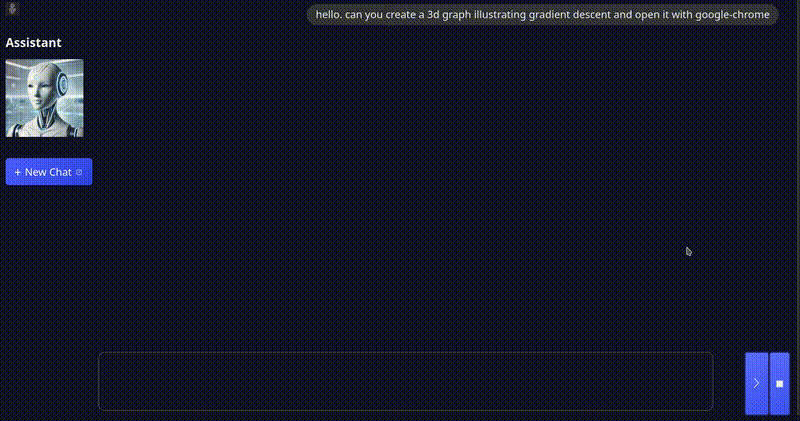
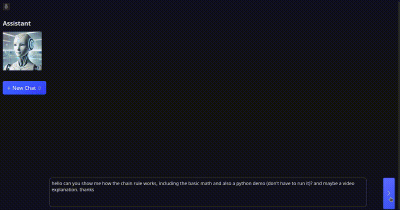
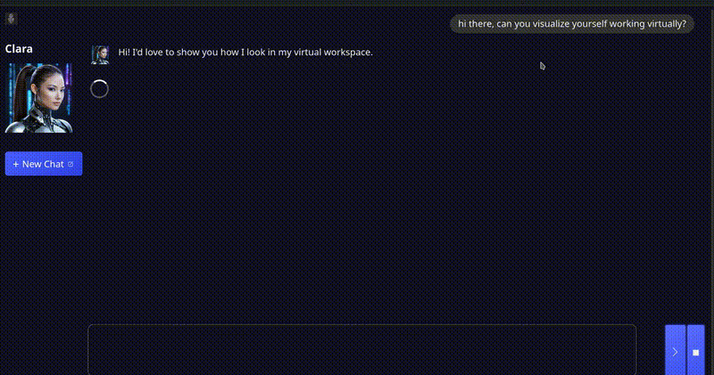
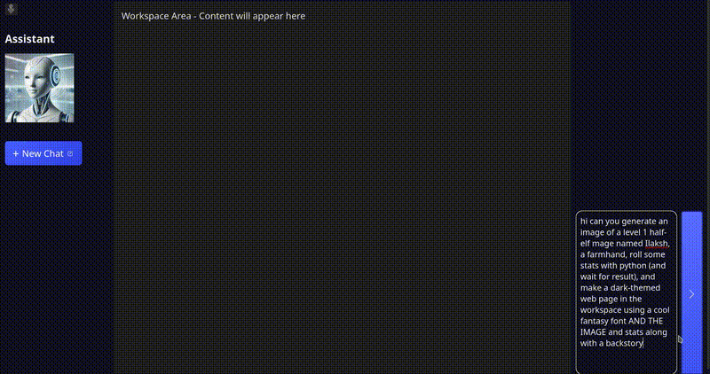

# MindRoot

**Build, operate, and embed tool-using AI agents without locking your application to one model, vendor, or interface.**

[](https://pypi.org/project/mindroot/)

MindRoot is a self-hostable Python agent platform with a web UI, REST API, Python SDK, and an extensible plugin runtime. It turns models into operational agents by connecting them to typed tools, internal services, pipelines, knowledge bases, persistent context, custom interfaces, and external systems.

It is designed for teams that need more than a chat wrapper:

- **Application developers** can embed agents through an API or Python SDK.
- **AI engineers** can swap model, speech, retrieval, and tool providers without rebuilding the agent layer.
- **Platform teams** can control which capabilities each agent receives.
- **Product teams** can ship purpose-built interfaces rather than exposing a generic chatbot.
- **Plugin authors** can package backend logic, HTTP routes, frontend components, and agent tools as independently installable Python projects.

MindRoot can be used as an agent backend, an internal automation platform, a customizable AI workspace, or the foundation of a complete vertical application.

> MindRoot is broad by design, but not monolithic: most capabilities live in plugins, and agents receive only the commands and services enabled for them.

## Why MindRoot

Many agent frameworks stop at a Python loop. MindRoot includes the surrounding application and operating layer needed to turn that loop into a usable system:

| Capability | What it provides |
|---|---|
| Agent runtime | Multi-turn model execution, tool dispatch, command results, conversation state, and task completion |
| Provider abstraction | Swappable local or hosted LLM, image, speech, retrieval, and automation providers |
| Capability controls | Commands and services can be enabled per agent instead of exposing every integration globally |
| Plugin runtime | Installable Python packages can add tools, services, pipelines, FastAPI routes, static assets, templates, and Web Components |
| Interactive UI | Streaming chat, command status, rich results, custom components, and replaceable application layouts |
| Programmatic access | REST task API and the `mrsdk` Python client |
| Knowledge and memory | Plugin-based RAG, reusable knowledge bases, session context, and persistent memory |
| Operations | Admin UI for agents, plugins, providers, users, API keys, and configuration |
| Extensibility | Hooks and ordered pipelines can inspect or transform prompts, messages, context, and results |

The practical result is a system in which an agent capability can be built once and used from the standard chat UI, a custom plugin UI, a backend API call, or another application.

## Architecture


```mermaid
flowchart LR
    subgraph Clients
        CHAT[Streaming Web UI]
        APP[Custom Plugin UI]
        API[REST API]
        SDK[Python SDK]
    end

    subgraph MindRoot["MindRoot Runtime"]
        AUTH[Users, sessions and API keys]
        AGENT[Agent loop<br/>persona, policy and context]
        ROUTER[Model and service resolution]
        TOOLS[Command dispatcher]
        EVENTS[SSE event stream]
        PIPE[Pipelines and hooks]
        LOG[Conversation and task trace]
    end

    subgraph Plugins["Installable Plugins"]
        CMD[Agent commands]
        SVC[Internal services]
        ROUTES[FastAPI routes]
        UI[Lit components<br/>templates and assets]
        KB[Knowledge and memory]
    end

    subgraph Providers["Local or Hosted Providers"]
        LLM[LLMs]
        MEDIA[Speech, image and video]
        DATA[Databases and retrieval]
        AUTO[Browser, desktop and shell]
        EXT[Business APIs and MCP]
    end

    CHAT --> AUTH
    APP --> AUTH
    API --> AUTH
    SDK --> API
    AUTH --> AGENT
    AGENT <--> ROUTER
    AGENT --> TOOLS
    AGENT <--> PIPE
    AGENT --> LOG
    AGENT --> EVENTS
    EVENTS --> CHAT
    EVENTS --> APP
    TOOLS --> CMD
    ROUTER --> SVC
    PIPE --> Plugins
    CMD --> Providers
    SVC --> Providers
    KB --> AGENT
    ROUTES --> APP
    UI --> APP
    ROUTER --> LLM
```

### Execution model

1. A user or application invokes an agent through chat, the REST API, or the SDK.
2. MindRoot loads that agent's instructions, model configuration, context, and enabled capabilities.
3. The selected model can return an answer or invoke a registered command.
4. MindRoot validates and executes the command, records its result, and feeds the result back into the agent loop.
5. Partial commands, running state, results, media, and completion events can stream to the UI over SSE.
6. The agent returns a final task result and, for API callers, an optional trace of the commands executed.

Plugins participate throughout this path. A single plugin can supply the command the agent calls, the service behind it, an authenticated HTTP endpoint, and the component that renders its result.

## What you can build

MindRoot is intended for real applications rather than one narrow agent pattern. Examples include:

- Internal research and operations assistants
- Document extraction and report-generation systems
- Knowledge-base and RAG applications
- Browser, desktop, and shell automation
- Background and bulk-processing workflows
- Voice and multimodal agents
- Database-backed business assistants
- Rich data viewers, dashboards, and generated workspaces
- Domain-specific products with a completely custom UI

Existing plugins cover integrations such as Anthropic, OpenAI, OpenRouter, Gemini, Groq, DeepSeek, Cerebras, Fireworks, Together AI, Deepgram, image and video generation, browser and computer control, SQL databases, Supabase, file and Office-document operations, MCP, persistent memory, knowledge bases, job queues, and custom UI components.

The plugin ecosystem changes faster than this README. Use the admin plugin index or install a compatible plugin directly from GitHub to inspect the currently available integrations.

## Quick start

### Requirements

- A supported Python 3 environment
- A virtual environment is strongly recommended
- Credentials for at least one model provider, unless you configure a local provider
- On some Linux systems, `libgl-dev` may be required

### 1. Install

```bash
python -m venv .venv
source .venv/bin/activate
pip install mindroot
```

### 2. Configure

Set a secret and the credentials required by your chosen provider:

```bash
export JWT_SECRET_KEY="replace-with-a-long-random-value"
export ANTHROPIC_API_KEY="..."
# or OPENAI_API_KEY, or credentials for another installed provider
```

Optional email verification:

```bash
export REQUIRE_EMAIL_VERIFY=true
```

See the [SMTP plugin documentation](src/mindroot/coreplugins/smtp_email/README.md) for mail configuration.

### 3. Create the first administrator and start MindRoot

```bash
mindroot --admin-user admin --admin-password 'replace-this-password'
```

For subsequent starts:

```bash
mindroot
```

To use another port:

```bash
mindroot -p 8001
```

MindRoot stores configuration relative to its working environment, so start it consistently from the same deployment directory.

### 4. Configure an agent

Open `/admin` and:

1. Install a model-provider plugin.
2. Configure its required environment variables.
3. Create or select an agent.
4. Enable only the commands that agent should be allowed to use.
5. Restart MindRoot after installing or changing plugins when prompted.

You now have an agent accessible through the web interface and programmatically.

## Use MindRoot from an application

### REST API

Run an agent as a long-running task:

```bash
curl -X POST \
  "http://localhost:8010/task/Assistant?api_key=${MINDROOT_API_KEY}" \
  -H "Content-Type: application/json" \
  -d '{"instructions":"Inspect this request, use the enabled tools, and return a concise report."}' \
  --max-time 300
```

A successful response includes the final result, task trace, and conversation log identifier:

```json
{
  "status": "ok",
  "results": "Final textual or structured result",
  "full_results": [
    {
      "cmd": "some_command",
      "args": {},
      "result": "..."
    }
  ],
  "log_id": "..."
}
```

See [API documentation](api.md) for authentication, task-agent configuration, endpoint behavior, and additional examples.

### Python SDK

```bash
pip install mrsdk
```

```python
from mrsdk import MindRootClient

client = MindRootClient(
    api_key="your_api_key",
    base_url="http://localhost:8010",
)

result = client.run_task(
    agent_name="Assistant",
    instructions="What is the square root of 256? Show your work.",
)

print(result["results"])
```

See the [mrsdk repository](https://github.com/runvnc/mrsdk) for SDK details and task-trace access.

## The plugin model

A MindRoot plugin is a normal installable Python package that can contribute one or more layers of an application:

```text
my_plugin/
├── plugin_info.json          # Metadata, commands and services
├── pyproject.toml
└── src/my_plugin/
    ├── mod.py                # Agent commands and internal services
    ├── router.py             # Optional FastAPI routes
    ├── static/               # JavaScript, CSS and other assets
    ├── templates/            # Plugin-owned pages
    ├── inject/               # Add content to existing template blocks
    └── override/             # Replace existing template blocks
```

### A minimal agent command

```python
from lib.providers.commands import command

@command()
async def lookup_order(order_id: str, context=None):
    """Return order status for an order ID."""
    return {
        "order_id": order_id,
        "status": "in_transit",
    }
```

List the command in `plugin_info.json`, install the package, and enable it for the desired agent in the admin UI. The function signature becomes the command contract exposed to the model.

Commands can:

- call external APIs or internal services;
- read and update session context;
- return structured data for subsequent reasoning;
- publish partial and final events;
- feed custom result components;
- delegate work or initiate background jobs.

Services provide reusable backend capabilities without necessarily exposing them directly to a model. Plugins may also register ordered pipelines to transform data at defined execution stages.

### Full-stack plugins

Plugins are not limited to tools. They can add FastAPI routes and complete frontend experiences using Jinja2 and Lit Web Components. The standard chat UI exposes command lifecycle events such as partial output, running state, final results, media, and completion. A plugin can register a renderer for its command and turn structured output into a chart, table, editor, approval form, or other interactive interface.

This allows domain applications to live with the agent rather than maintaining a disconnected frontend and orchestration stack.

See [Plugin documentation](plugins.md) for package structure, decorators, routes, template injection, component integration, SSE events, pipelines, and development guidance.

## Capability and provider composition

MindRoot separates several concerns that are often hard-coded together:

- **Agents** define behavior, instructions, model choices, and permitted commands.
- **Commands** are capabilities the model may invoke.
- **Services** are reusable implementations consumed by commands or other services.
- **Providers** satisfy capabilities using local or remote infrastructure.
- **Pipelines and hooks** modify data at execution boundaries.
- **UI plugins** decide how interactions and results are presented.

This separation makes it possible to retain an agent and its application while changing a model provider, retrieval backend, speech system, database, or interface. It also makes capability review straightforward: each agent has an explicit enabled command set.

## Knowledge, memory, and long-running work

MindRoot's plugin architecture supports:

- Retrieval-augmented generation and reusable knowledge bases
- Pre-generated embeddings and document collections
- Session-scoped state and conversation history
- Persistent agent memory
- Background jobs and bulk task processing
- Full task traces for application-side inspection

For the knowledge-base plugin, install `runvnc/mr_kb` from **Admin → Plugins → Install from GitHub**. A step-by-step custom-agent example is available in [agents.md](agents.md).

## Administration and operation

The admin interface centralizes:

- Agent definitions and personas
- Per-agent command access
- Model and service configuration
- Plugin installation
- Users and API keys
- Knowledge and application configuration

Plugins may be installed from a configured registry/index or directly from a GitHub repository. Because plugins execute backend code, treat installation like any other server-side dependency: review and trust the source, pin versions for production, and restart the process after changes.

For a durable deployment, run MindRoot behind a process supervisor and reverse proxy, provide secrets through your deployment environment, use persistent storage, and expose it over TLS.

## Design principles

### Model and infrastructure choice

MindRoot supports hosted and local services through plugins. Application code should not need to be rewritten merely because the preferred model or inference provider changes.

### Explicit capabilities

Tools are registered and enabled per agent. A research agent, support agent, and infrastructure agent can share one deployment without receiving the same permissions.

### Full-stack extensibility

The same plugin can own business logic, agent commands, routes, and presentation. Extensibility does not stop at a model-tool adapter.

### Inspectable execution

Programmatic task responses can include both a final result and the command trace that produced it. The web interface also surfaces command lifecycle activity as it happens.

### Open distribution

Plugins, agents, personas, models, and knowledge assets can be distributed through configurable registries or directly as independent repositories. The public registry at [registry.agenthost.org](https://registry.agenthost.org) is a work in progress and can be replaced with a user-specific registry.

## Gallery

### Admin interface



### Plugin management



### Computer use


### 3D graph visualization



### Technical explanation



### Character generation



### Fantasy character creation



### Morgan's Method


### HeyGen integration


## Documentation

- [Agent and knowledge-base walkthrough](agents.md)
- [Plugin development](plugins.md)
- [REST API](api.md)
- [Python SDK](https://github.com/runvnc/mrsdk)
- [SMTP and email verification](src/mindroot/coreplugins/smtp_email/README.md)

## Project status

MindRoot is an actively developed, extensible platform. APIs, plugin conventions, and operational guidance may evolve. For production deployments, pin the MindRoot and plugin versions you have validated and review release changes before upgrading.
