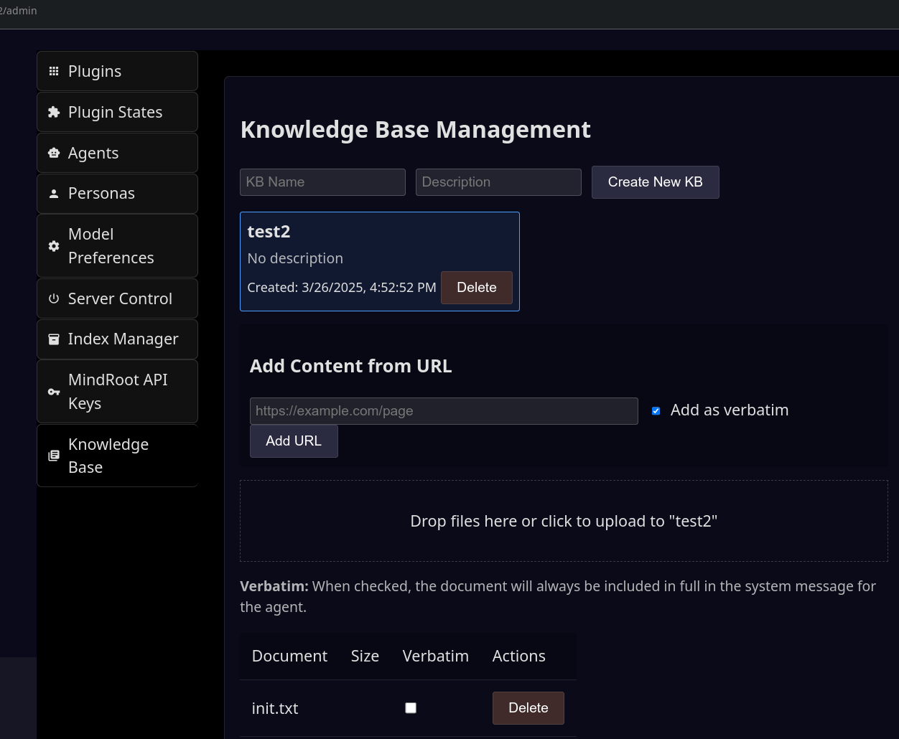
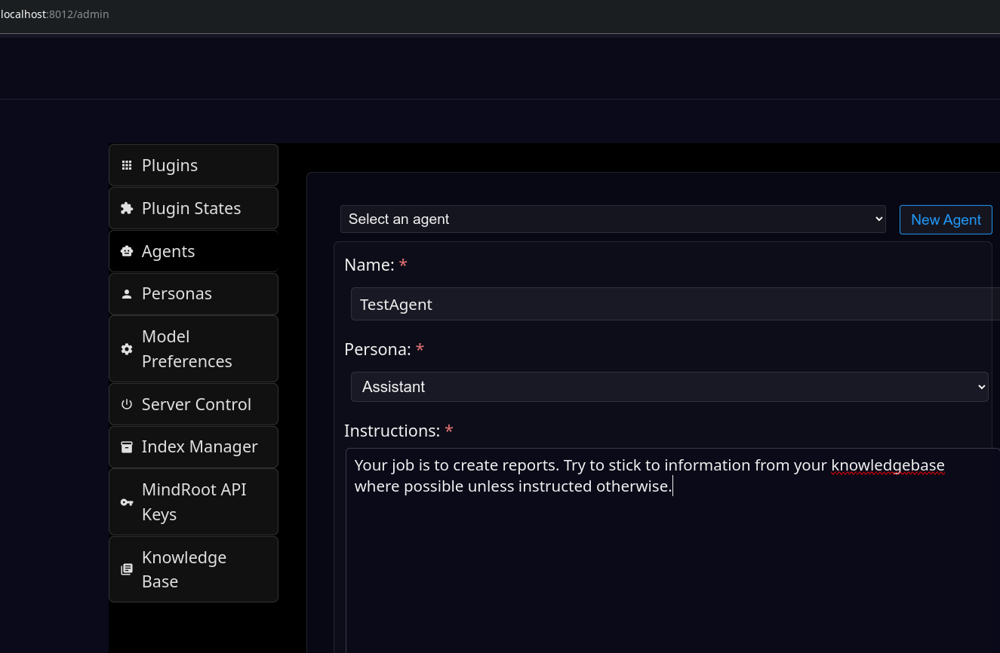
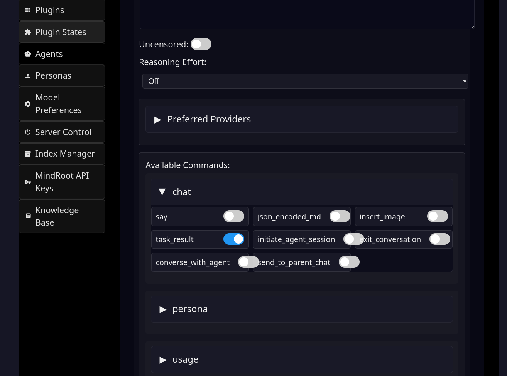
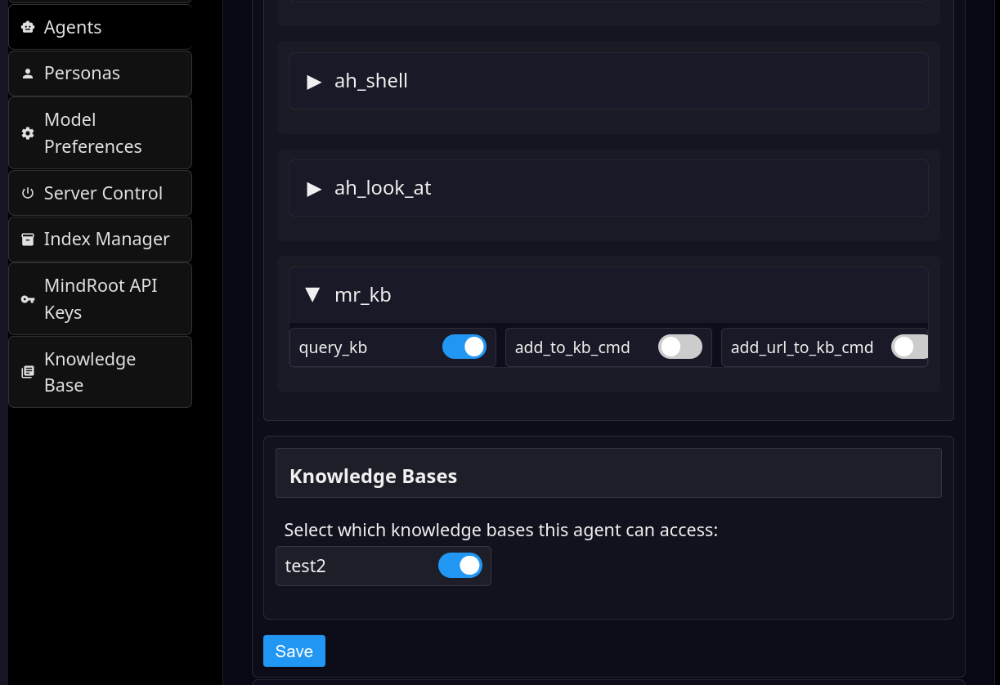

# Tutorial: Custom Agent with Knowledgebase

Note: this assumes you are using the mr_kb plugin for the knowledgebase. Feel free to implement your own plugin if this system
is not ideal for your use case.

## Install `mr_kb` Plugin

This will already be completed if you have used a knowledgebase for another agent.

Make sure the [runvnc/mr_kb](https://github.com/runvnc/mr_kb) MindRoot plugin is installed.

(To install a plugin, go to the the `/admin` page and click the Plugins tab.
Then click the button that says "Install from Github" and enter the repo, e.g. `runvnc/mr_kb`)

Wait until the confirmation pops up, then restart the MindRoot server.

## Creating a KB

Go to the Knowledge Base tab under `/admin`

1. Enter a KB name in the KB Name field, then press Create New KB.

2. Wait a moment. A new KB should show below with a single 'init.txt' document.

3. If the KB does not appear below:

  - make sure you have your OPENAI_API_KEY environment variable set 
  - restart the server
  - try to create the KB again

## Upload documents to the KB

You can click on the upload zone or drag and drop files to upload.
Once uploaded, the files will immediately be "chunked" into text snippets 
and each snippet will have an embedding vector created for it using OpenAI.
These will be stored in a vector database on the server.

You can also load in a web page in the Add Content from URL section.

Once the embedding is complete the total completed will update on the screen
(e.g. 1/1). For a long document this can take a few minutes.

### Pinning Documents to the System Message

If you have documents that are smallish and are required information for the agent,
you should check the box that says "Verbatim". This will ensure that the full 
text of the document is always included in the System message for the agent.

By default, the system will do a typical RAG vector/kb search where your user
message is matched as closely as possible to snippets of text from the KB.
It will retrieve several snippets and insert them for the agent to select the most
relevant information.

The vector/kb search can often retrieve the most relevant information from the KB documents,
but this is not guaranteed the way that including the text in the System message is.
For critical information, ideally it is stated in a concise form and included directly in the Agent instructions
or in a document in the KB with the Verbatim checkbox toggled on.

For very long documents, you will need to use the default vector/kb retrieval method to 
avoid filling up the context window of the LLM.

## Creating an Agent

Go to the `/admin` page and click on the Agents tab.

### Name and Persona

Click the New Agent button and enter the agent name.

Select the Assistant persona from the drop down.

### Instructions

Enter some instructions for the agent. This is very important, as it will go into 
the System message to the LLM, which has extra emphasis.

### Reasoning Effort

Select the Reasoning Effort from the Drop Down. You should select Off unless you are sure about this.

### Tool Commands

Specify some tool commands.

  - click on the `chat` section to open it

  - toggle the 'task_result' command On

  - click on the `mr_kb` section to expand it

  - toggle the `query_kb` command On

### Save Agent

Note: if you forget to select something like the Persona, the agent may not save properly,
so you may wish to make a backup of your instructions in your clipboard before saving.

Scroll down and press the Save Button.

### Knowledgebase Selection

Go to the dropdown and select the agent you just created. (If it does not show in the list, refresh the page).

Scroll to the bottom of the agent form near the Save button. There will now be a section with a list of 
available knowledgebases. Toggle the ones you want your agent to access and press the Save button again.

## Using your Agent

Go to the `/` (home) page and click on the button with the name of your agent.
It will open in a new window with a chat interface. You can type your question or
request here.
The agent will use your KB and it's intrinsic knowledge to output a task_result()
(if you just enabled that tool) or run other commands you specified.

## Important Notes for Programmers: Use with API

1. To use this agent with the `/task` endpoint programmatically, you will need
to make sure the `task_result` command is enabled, and also do NOT enable
commands like `say` or `json_encoded_md` that will wait for the user to reply,
because if the agent chooses to use these commands then the task loop
will halt waiting for input before the agent has finished.

2. The system instructions in the Agent form will remain in effect when you
use the `/task` endpoint, which specifies the `user` message as it's instructions
field. You do not need to repeat the System message in an API call, and 
you should make sure there is no conflict in the instructions.

### Report Generation Concept

Please see the bottom of the [API](api.md) document for a recommendation on instructions and schema for 
formatted reports.

