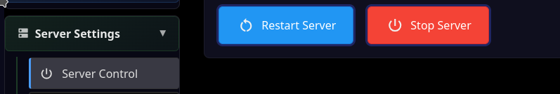
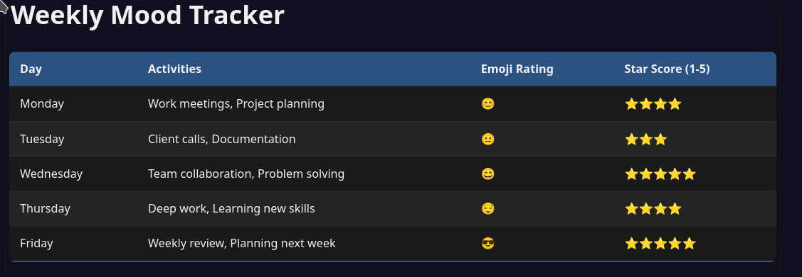
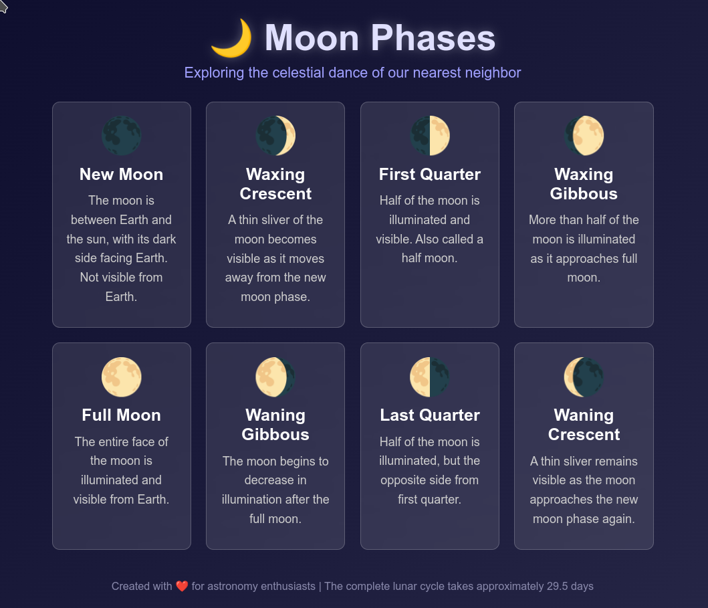

Getting Started
===============

If MindRoot is already installed and running, skip to `LLM Plugin Installation`_.
If using pre-configured MindRoot hosting, skip to `LLM API Key`_.

.. todo:: Add getting started content here

Installation
------------

Usually you need to create a python virtual environment:

``python -m venv .venv``

And activate:

``source .venv/bin/activate``

Then just install with pip:

``pip install mindroot``

Starting MindRoot
-----------------

The first time you can specify the admin user and password:

``mindroot -u admin -pw password``

The server defaults to `http://0.0.0.0:8010/ <http://0.0.0.0:8010/>`_ .
You will need to log in.

LLM Plugin Installation
-----------------------

- Go to the `/admin` page by clicking the Admin link at the top of the home page.

- Go to the Install/Registry tab

- Search for 'OpenRouter' and click Install next to the result that comes up.

.. image:: installopenrouter.png

- A dialog will show the log of the installation.

- Restart: Server Settings | Server Control | Restart

If you want, you can make sure the OpenRouter Plugin is installed:

- Go to the /admin page (Admin link on home page)

- Expand the Advanced section and click on Plugins

- OpenRouter/ah_openrouter should show up

.. image:: openrouter.png

LLM API Key
-----------

For this section you will need an API key from an LLM provider.
We will assume OpenRouter for this example.

Now, enter your `OpenRouter API key <https://openrouter.ai/settings/keys>`_:

- Go to `/admin` (Admin link on home page) Advanced | Environment Variables

.. image:: envvar.png

- Find the ah_openrouter section and the `OPENROUTER_KEY` field; click Edit.

- Enter your key and press Save.

Finally, restart MindRoot:

- Go to Admin | Server Settings |  Server Control 
- Click on Restart Server

Chat with Assistant
-------------------

- On the home page, click the Assistant button.

- A new tab will open with a chat UI.

- Try requesting something from the assistant, for example:

  "Create a mood tracker table showing daily activities with emoji ratings and star scores for each day of the work week."

(Note: shown is typical output from DeepSeek Chat 3.1)

Install Plugins with Tools
--------------------------

(Note: if you are using MindRoot hosting, these tools are already installed).

- Go to Admin | Install/Registry

- Install the runvnc/ah_shell and runvnc/ah_files plugins:

- Click on Plugins.

- Enter e.g. "Files" in the Search input

.. image:: files.png

- Click Install

- Repeat for Shell (execute commands)

- Restart MindRoot:

- Go to Admin | Server Settings |  Server Control
- Click on Restart Server

Give Assistant a Programming Task
---------------------------------

- On the home page, click the Assistant button to open a new chat.

- "Create a simple but beautiful web page about the phases of the moon. Save to ./imgs/moon.html and provide a clickable link to /imgs/moon.html"

(Note: shown is typical output from DeepSeek Chat 3.1)

