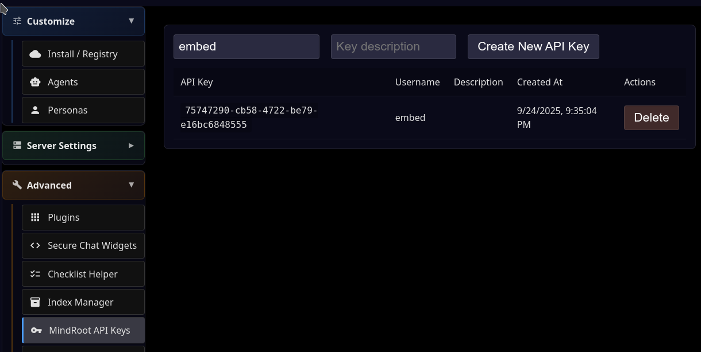
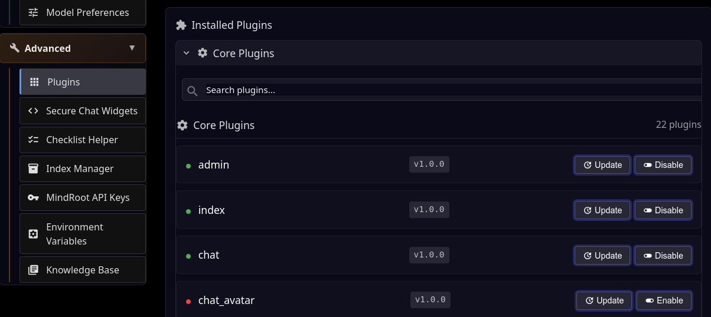
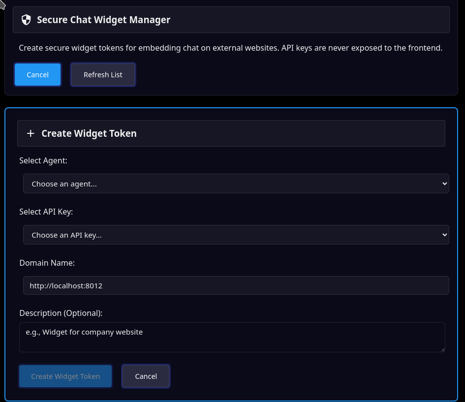
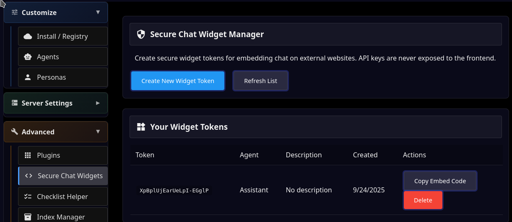
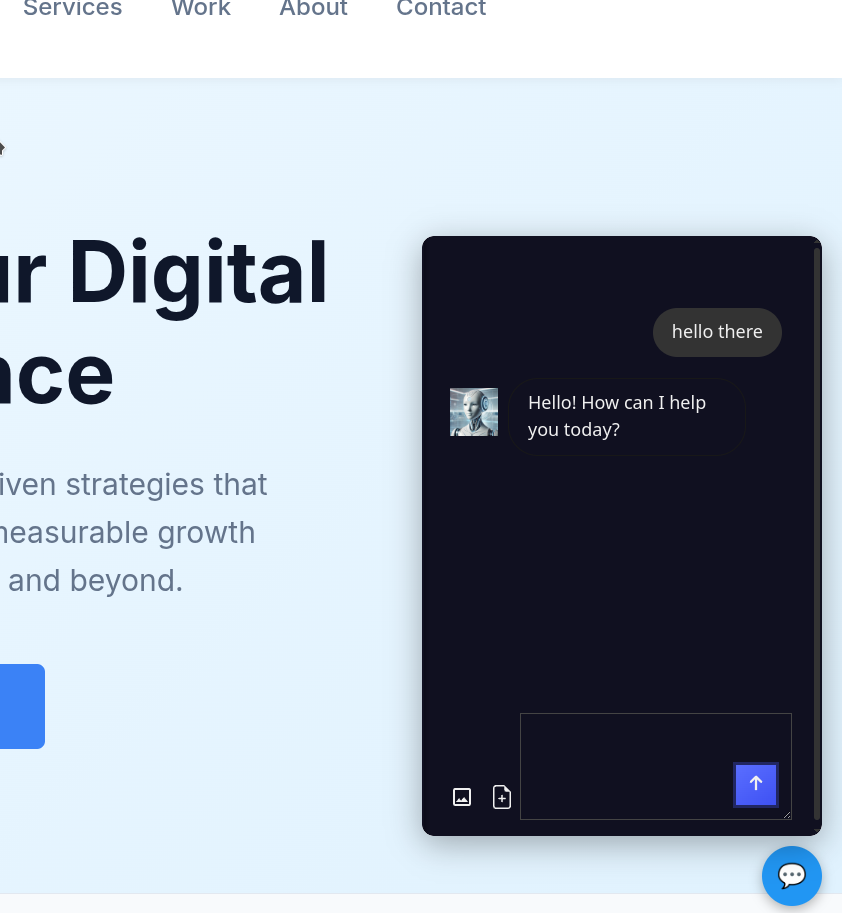

Embed Agent Chat on Your Website
=================================

Create an API Key
-----------------

- Go to /admin | Advanced | API Keys

- Enter a username and click Create New API Key

- Note that the user must exist. 'admin' is OK for testing.

Disable Chat Avatar on Left
---------------------------

- Go to /admin | Advanced | Plugins

- Click on Core Plugins

- Click the Disable button next to `chat_avatar`

Get Chat Widget Embed Code
--------------------------

- Go to /admin | Advanced | Secure Chat Widget

- Cick Create New Widget Token

- Select the agent, API key, and enter the URL of the MindRoot instance.

- Click Create New Widget Token

- Click on the Copy Embed Code button to copy the code to your clipboard.

Insert into HTML
----------------

Paste the `<script>` tag into your HTML page before the ending `</body>` tag.
When you load the page, you should see the chat widget in the lower right corner.

