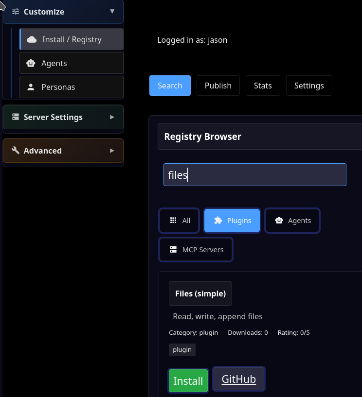

Install Plugins with Tools
==========================

(Note: if you are using MindRoot hosting, these tools are already installed).

- Go to Admin | Install/Registry

- Install the runvnc/ah_shell and runvnc/ah_files plugins:

- Click on Plugins.

- Enter e.g. "Files" in the Search input

- Click Install

- Repeat for Shell (execute commands)

- Restart MindRoot:

- Go to Admin | Server Settings |  Server Control
- Click on Restart Server

.. image:: restart.png