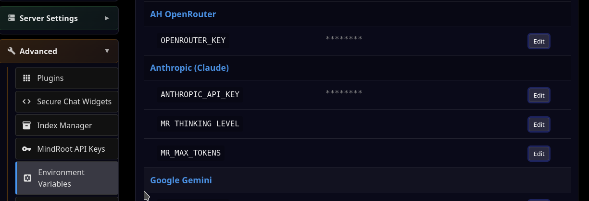

LLM API Key
===========

For this section you will need an API key from an LLM provider.
We will assume OpenRouter for this example.

Now, enter your `OpenRouter API key <https://openrouter.ai/settings/keys>`_:

- Go to `/admin` (Admin link on home page) Advanced | Environment Variables

- Find the ah_openrouter section and the `OPENROUTER_KEY` field; click Edit.

- Enter your key and press Save.

Finally, restart MindRoot:

- Go to Admin | Server Settings |  Server Control 
- Click on Restart Server

.. image:: restart.png