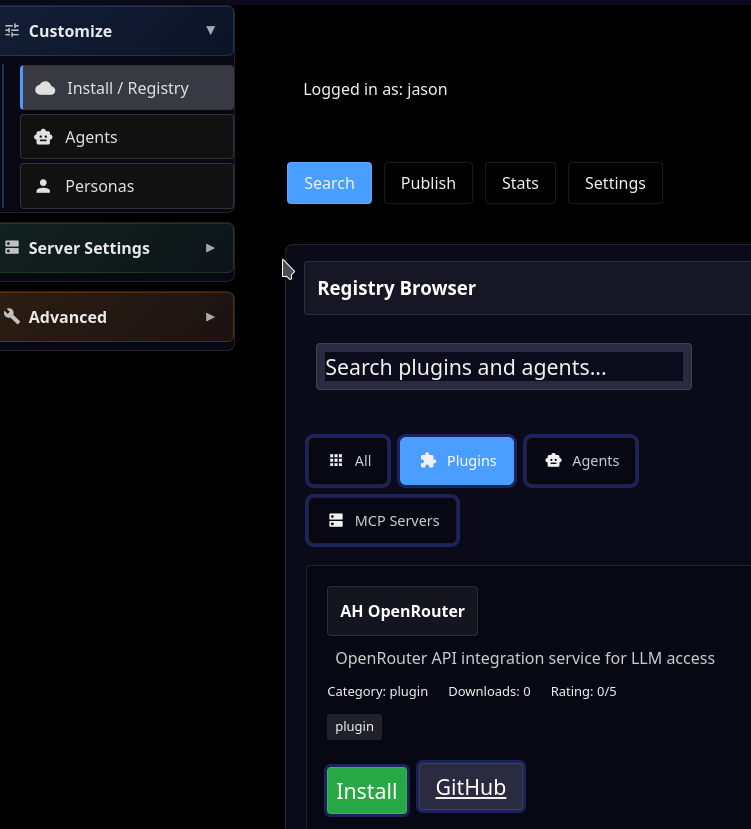
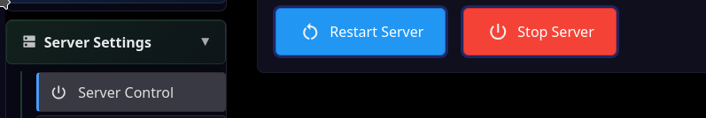
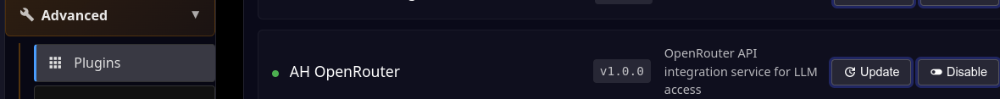

LLM Plugin Installation
=======================

- Go to the `/admin` page by clicking the Admin link at the top of the home page.

- Go to the Install/Registry tab

- Search for 'OpenRouter' and click Install next to the result that comes up.

- A dialog will show the log of the installation.

- Restart: Server Settings | Server Control | Restart

If you want, you can make sure the OpenRouter Plugin is installed:

- Go to the /admin page (Admin link on home page)

- Expand the Advanced section and click on Plugins

- OpenRouter/ah_openrouter should show up

