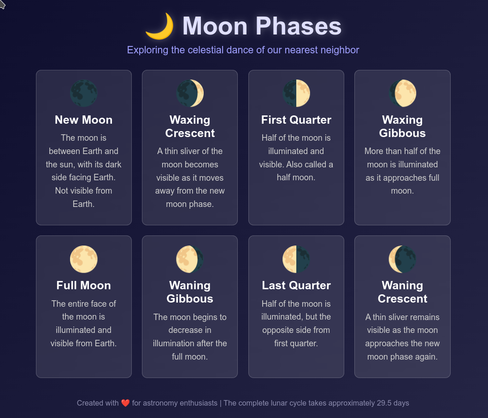

Give Assistant a Programming Task
=================================

- On the home page, click the Assistant button to open a new chat.

- "Create a simple but beautiful web page about the phases of the moon. Save to ./imgs/moon.html and provide a clickable link to /imgs/moon.html"

(Note: shown is typical output from DeepSeek Chat 3.1)